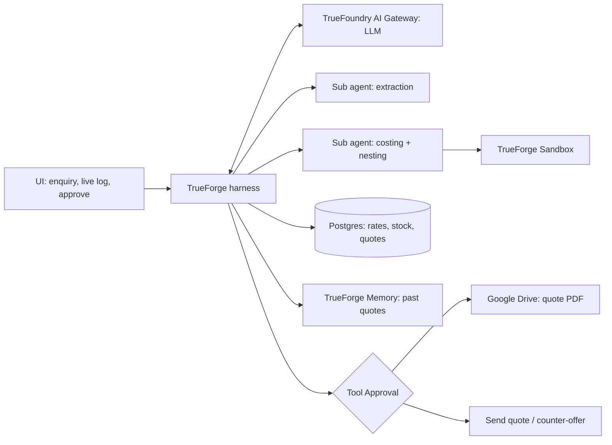
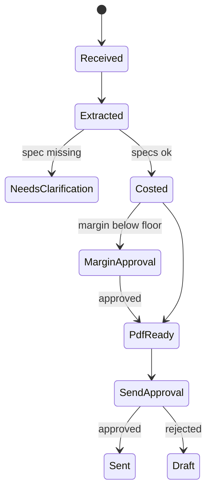

# QuoteForge: Factory Quotation Agent

Sep 26, 2026 · @Akshat Patil

## Final scope (2 people, 7 hours)

We build 13 must-haves, then 3 winning features in order. Everything else is stretch or out. The demo runs on dummy data, with Postgres, the TrueForge sandbox and Drive as real systems.

| # | Feature | Bucket |
| --- | --- | --- |
| 1 | Enquiry input (paste text) | Must |
| 2 | Spec extraction to JSON (item, material, dimensions, qty) | Must |
| 3 | Missing info detection + clarification question | Must |
| 4 | Rate card tool (material, labour, finishing, overhead, margin, GST) | Must |
| 5 | Stock check tool | Must |
| 6 | Sandbox costing (agent writes and runs calc code) | Must |
| 7 | Quote breakdown (line items, subtotal, GST, total) | Must |
| 8 | Approval pause before sending quote (TrueForge Tool Approval) | Must |
| 9 | Quote PDF | Must |
| 10 | Low margin guard (extra approval) | Must |
| 11 | Agent run log + UI (TrueForge Generative UI or simple HTML) | Must |
| 12 | Self-check: sanity check on every costing, re-run on failure | Must (cheap) |
| 13 | Rate staleness guard: rate card older than 7 days needs owner confirm | Must (cheap) |
| 14 | Sheet nesting optimizer (real scrap instead of flat wastage) | Winning |
| 15 | Negotiation: counter-offer with pause before sending | Winning |
| 16 | Past-quote memory for price consistency | Winning |
| 17 | Quote PDF upload to Google Drive | Should |
| 18 | Low stock: supplier PO draft with its own pause | Stretch |
| 19 | Real email send to a test inbox | Stretch |

**Out of scope:** drawings/images, WhatsApp, real customer data, Tally/accounting, auth, multi-user.

**Demo scenarios (seeded before the event):**

1. Clean enquiry: 50 MS brackets, 200x100x8 mm, powder coated. Goes straight to approval.
2. Missing thickness: agent stops and asks the customer.
3. Low margin: customer asks for a target price, margin drops below 12%, owner approval needed.
4. Low stock: SS 304 sheet short, agent flags it in the quote notes (PO draft if stretch is done).

## PRD

**One line:** QuoteForge turns a customer enquiry into a verified, approved quotation for a small fabrication shop in minutes, and never sends anything without the owner's OK.

### Problem

Small MSME fabrication shops quote every job by hand. The owner reads the enquiry, calculates weight, looks up rates, checks stock, adds labour and margin, then types a quote. It takes 1 to 2 hours per enquiry, math errors cost money, and slow replies lose orders.

### Users

| User | Need |
| --- | --- |
| Shop owner | Fast, correct quotes; final say on price and on anything sent out |
| Customer | Quick quote, and a clear question when the enquiry is incomplete |

### Goals

- Enquiry to draft quote in under 2 minutes
- Every number comes from the rate card or from code run in the sandbox, never from the LLM's head
- Nothing irreversible (send quote, place order) happens without an explicit approval

### Non-goals

- Replacing the owner's pricing judgement
- Reading engineering drawings
- Accounting, invoicing, payments

### User stories

1. As an owner, I paste an enquiry and get a line-item quote with a cost breakdown.
2. As an owner, if the enquiry is missing specs, I see the exact question to send the customer.
3. As an owner, if margin falls below my floor, the agent stops and asks me.
4. As an owner, I see every step the agent took and every assumption it made.
5. As an owner, I approve or reject before the quote goes out.

### How it maps to hackathon judging

| Required by judges | Where it shows |
| --- | --- |
| Real tool reached | Shop DB (rate card + stock), PDF generator, email |
| Code run in sandbox | Costing script written and executed by the agent |
| Pause before irreversible action | Approval gate before send, extra gate on low margin |

### Success criteria for demo

- All 4 demo scenarios run end to end without manual fixes
- Costing output matches a hand calculation for scenario 1
- Run log shows each tool call and each pause

## HLD

The LLM plans, TrueForge runs the loop, and every fact or number comes from a tool. Four layers: UI, agent harness, tools, data.



### Components

| Component | Job | Tech |
| --- | --- | --- |
| UI | Paste enquiry, watch steps live, approve or reject, download PDF | TrueForge Generative UI, fallback simple HTML |
| TrueForge harness | Agent loop, sub agents, tool calls | `npx @truefoundry/trueforge` |
| Sandbox | Runs costing, nesting and self-check code in isolation | TrueForge built-in |
| Tool Approval | Human-in-the-loop gates on irreversible tools | TrueForge built-in |
| Memory | Past quotes for price consistency | TrueForge built-in, backed by quotes table |
| AI Gateway | LLM access, any provider | TrueFoundry AI Gateway |
| Shop DB | Rate card, stock, customers, quotes | Postgres (built-in tool), Docker locally |
| PDF + storage | Quote document, uploaded to Drive | HTML-to-PDF + Drive tool |

### End-to-end flow

1. Owner pastes enquiry in UI.
2. LLM extracts specs into JSON. Missing field → return clarification question, stop.
3. Agent calls `get_rate_card` and `check_stock`.
4. Agent writes a costing script and runs it in the sandbox. Output is a JSON cost breakdown.
5. Margin below floor → pause, owner approves or edits margin.
6. Agent calls `make_quote_pdf`.
7. Pause: "Quote of Rs X ready for customer Y. Send?"
8. Approved → `send_quote`. Rejected → saved as draft.

### Approval gates

| Gate | Trigger | Why it matters |
| --- | --- | --- |
| Clarification | Required spec missing | Wrong spec = wrong price |
| Low margin | Margin < 12% | Protects the business |
| Send quote | Every quote | A sent price is a commitment |
| Supplier PO (stretch) | Stock short | Placing an order spends money |

### Design rules

- LLM never does arithmetic in text. All math goes through `run_code`.
- Tools that change the outside world (`send_quote`, `create_po`) go through TrueForge Tool Approval.
- Every step is logged with input, output and assumption.

## LLD

Six tools, four DB tables, one costing script, one state machine. Tool registration syntax gets finalised after the TrueForge walkthrough at kickoff.

### DB schema (Postgres)

| Table | Columns |
| --- | --- |
| materials | id, name (MS / SS304 / AL), density\_kg\_m3, rate\_per\_kg, wastage\_pct |
| labour\_rates | op (cutting / bending / welding / drilling), unit (per\_piece / per\_bend / per\_m / per\_hole), rate |
| finishing\_rates | type (powder\_coat / paint / galvanise), rate\_per\_m2 |
| settings | overhead\_pct, margin\_pct, margin\_floor\_pct, gst\_pct |
| stock | material\_id, thickness\_mm, sheet\_size, qty\_kg |
| quotes | id, customer, spec\_json, breakdown\_json, total, status, pdf\_path, created\_at |

**Seed values (dummy):** MS 7850 kg/m3 at Rs 62/kg, SS304 8000 kg/m3 at Rs 230/kg, AL 2700 kg/m3 at Rs 280/kg, wastage 5%, overhead 10%, margin 20%, margin floor 12%, GST 18%.

Labour: cutting Rs 15/piece, bending Rs 10/bend, welding Rs 120/m, drilling Rs 5/hole. Finishing: powder coat Rs 180/m2, paint Rs 90/m2, galvanise Rs 250/m2.

### Spec JSON (output of extraction)

```json
{
  "customer": "Sharma Industries",
  "items": [{
    "name": "L bracket",
    "material": "MS",
    "length_mm": 200, "width_mm": 100, "thickness_mm": 8,
    "qty": 50,
    "ops": {"cutting": 1, "bends": 1, "weld_m": 0, "holes": 2},
    "finish": "powder_coat"
  }],
  "target_price": null,
  "missing": []
}
```

If `missing` is not empty, the agent stops and returns one clarification question per field.

### Tools

| Tool | Input | Output | Irreversible |
| --- | --- | --- | --- |
| get\_rate\_card | materials list | rates, densities, settings | No |
| check\_stock | material, thickness, kg needed | available\_kg, short\_kg | No |
| run\_code | Python source | stdout (JSON breakdown) | No, sandboxed |
| make\_quote\_pdf | quote {customer, email, spec, breakdown (costing.py JSON unchanged), assumptions} | quote\_id (Q-0001), pdf\_path (quotes/Q-0001.pdf); rejects a breakdown that does not add up or does not match costing.py re-run on the spec with the shop's rate card | No |
| request\_margin\_approval | quote\_id, margin\_pct, margin\_floor\_pct, reason | approved status | **Yes, gated** (called only when margin is below floor) |
| send\_quote | quote\_id (from make\_quote\_pdf), email | sent status, pdf\_path | **Yes, gated** |
| send\_counter\_offer | quote\_id, email, options [{label, changes, total, unit\_price}], message | sent status | **Yes, gated** |
| create\_po (stretch) | material, qty | po\_id | **Yes, gated** |

### Costing formula (inside run\_code)

```latex
W = L \times B \times T \times \rho \times 10^{-9} \;\text{kg per piece}
```

```latex
C_{mat} = W \times q \times r_{kg} \times (1 + w)
```

```latex
P = (C_{mat} + C_{lab} + C_{fin}) \times (1 + o) \times (1 + m) \times (1 + g)
```

L, B, T in mm, rho in kg/m3, q = quantity, w = wastage, o = overhead, m = margin (markup on cost), g = GST. Labour = sum of op counts x rate x qty. Finish = surface area (both faces, m2) x rate x qty.

**Hand check, scenario 1:** 200 x 100 x 8 mm MS = 1.256 kg per piece, 62.8 kg for 50, material Rs 4,088 with 5% wastage. The script must match this.

`target_price` in the spec is the customer's order total including GST. Effective margin at that price = target / (1 + g) / (C × (1 + o)) − 1. Scenario 3 uses scenario 1 with a target of Rs 8,700, which gives 8.14%, below the 12% floor.

### Costing breakdown JSON (output of `sandbox/costing.py`, input to `make_quote_pdf`)

Money is rounded to paise per line, so line items add up exactly to every total. `unit_price_before_gst` is for display only and is not part of any sum.

`priced_at_floor` is true when run with `--at-floor`: the margin is `margin_floor_pct`, which gives the floor price used in negotiation (scenario 1 at floor: margin Rs 818.17, total Rs 9,010.81). `priced_at_target` is false for standard pricing. After the owner approves a below-floor margin, the agent re-runs with `--price-at-target`: the margin is solved so `total` equals `target_price` exactly (the margin line absorbs paise rounding), `margin.pct` shows the effective margin and `priced_at_target` is true. Scenario 3 at target: margin Rs 554.77 (8.14%), price before GST Rs 7,372.88, GST Rs 1,327.12, total Rs 8,700.00.

```json
{
  "customer": "Sharma Industries",
  "wastage_mode": "flat",
  "priced_at_target": false,
  "priced_at_floor": false,
  "items": [{
    "name": "L bracket", "material": "MS", "qty": 50,
    "dimensions_mm": [200, 100, 8],
    "weight_kg_per_piece": 1.256, "weight_kg_total": 62.8, "kg_needed": 65.94,
    "nesting": {"sheet_mm": [1250, 2500], "parts_per_sheet": 150, "orientation": "as_given", "sheets_needed": 1, "scrap_pct": 68.0},
    "line_items": [
      {"label": "Material", "detail": "62.8 kg MS @ Rs 62/kg + 5% wastage", "amount": 4088.28},
      {"label": "Cutting", "detail": "50 x 1 @ Rs 15 per_piece", "amount": 750},
      {"label": "Bending", "detail": "50 x 1 @ Rs 10 per_bend", "amount": 500},
      {"label": "Drilling", "detail": "50 x 2 @ Rs 5 per_hole", "amount": 500},
      {"label": "Finishing", "detail": "powder_coat, 2 m2 (both faces) @ Rs 180/m2", "amount": 360}
    ],
    "item_cost": 6198.28,
    "unit_price_before_gst": 163.63
  }],
  "cost_subtotal": 6198.28,
  "overhead": {"pct": 10, "amount": 619.83},
  "margin": {"pct": 20, "amount": 1363.62},
  "price_before_gst": 8181.73,
  "gst": {"pct": 18, "amount": 1472.71},
  "total": 9654.44,
  "margin_check": {"margin_floor_pct": 12, "target_price": null, "effective_margin_pct": null, "below_floor": false},
  "self_check": {"passed": true, "errors": []}
}
```

### UI API (`agent/api.py`, called by `server.js`)

`POST /api/quote {enquiry}` runs `api.py start`; `POST /api/decision {session_id, decision: "allow"|"deny", reason?}` runs `api.py decide`. Both return one JSON object:

```json
{
  "status": "needs_clarification | gate | done | error",
  "session_id": "01m3...",
  "questions": ["Could you please confirm the plate thickness of the L bracket (in mm)?"],
  "reply": "Thank you for your enquiry. ...",
  "spec": { "...": "validated spec" },
  "assumptions": ["L bracket: 1 cutting operation per piece."],
  "gate": {"kind": "margin | send | counter_offer", "tool": "send_quote", "args": {"quote_id": "Q-0003", "email": "..."}},
  "breakdown": { "...": "latest costing.py breakdown" },
  "quote": {"quote_id": "Q-0003", "pdf_path": "quotes/Q-0003.pdf"},
  "sent": {"quote": false, "counter_offer": false},
  "message": "agent's final message when status is done",
  "logs": ["get_rate_card done", "sandbox: ...", "make_quote_pdf done"],
  "error": "only when status is error"
}
```

`questions`/`reply` come only with `needs_clarification` (no agent session exists then). `gate` comes only with `gate`, read back from TrueForge's pending approvals. `sent` is true only when the send tool actually returned `"sent"`; the UI must not show "Sent" otherwise.

### Agent states



### System prompt (core rules)

- You are a quotation assistant for a small fabrication shop.
- Never invent a rate. Always call get\_rate\_card.
- Never do arithmetic in text. Write Python and call run\_code.
- If a required spec is missing, ask. Do not guess.
- Before send\_quote or create\_po, always stop for owner approval.
- Log every assumption in plain words.

### Folder structure

```
quoteforge/
  agent/        prompt, tool registration, harness config
  tools/        rate_card, stock, pdf, email
  db/           schema.sql, seed.sql, docker-compose.yml
  sandbox/      costing template
  ui/           index.html (or app.py for Streamlit)
  quotes/       generated PDFs
  demo/         4 scenario enquiries
```

## Team split

Akshat builds the brain, Famous builds the shop it works in. Lock the contract in the first 20 minutes, then work in parallel with mocks.

| | Akshat (agent) | Famous (shop + UI) |
| --- | --- | --- |
| Owns | TrueForge setup, gateway, prompts, sub agents, sandbox costing, self-check, nesting, negotiation, memory, approval gates | Postgres + seed data, rate card and stock queries, PDF, Drive upload, staleness guard, UI, demo enquiries |
| Folders | `agent/`, `sandbox/` | `db/`, `tools/`, `ui/`, `demo/`, `quotes/` |
| Mocks until real parts land | Fake tools returning hardcoded rates and stock | Hardcoded spec JSON and breakdown to build PDF and UI |
| Submission | Demo video narration, Q&A prep | Writeup, README, `.env.example`, build-story post |

**Contract to lock first (both, 20 min):** spec JSON format, each tool's input and output, DB schema. All three are in the LLD below.

**Sync points:**

- Hour 2: tools real, Akshat swaps mocks for real tools
- Hour 4: UI and agent joined for the first time
- Hour 5: run all 4 scenarios together, feature freeze

**Git rules:** one repo, each person commits in their own folders, small commits after every working piece, pull before push.

## 7-hour build plan

Akshat owns the agent (harness, prompt, sandbox). Famous owns the shop (DB, tools, PDF, UI, demo). Freeze features at hour 5.

| Hour | Akshat (agent) | Famous (shop + UI) |
| --- | --- | --- |
| 1 | TrueForge running, gateway connected, one tool call works. Repo public, MIT licence, first commit | Postgres in Docker, schema + seed, 4 demo enquiries, `.env.example` |
| 2 | Extraction prompt, spec JSON, missing-field check | Rate card + stock queries via Postgres tool, PDF template |
| 3 | Sandbox costing + self-check, match hand check | Quote PDF + Drive upload, rate staleness guard |
| 4 | Approval gates (margin, send) via Tool Approval | UI: Generative UI or HTML, live log, Approve / Reject |
| 5 | Full flow, all 4 scenarios. Then nesting optimizer | Negotiation scenario data, past quotes seeded. Freeze at end of hour |
| 6 | Negotiation or memory, whichever is closer | Record demo video (under 3 min), write 300-word writeup |
| 7 | Dry run the 8-min pitch twice, Q&A prep | README, submission form, build-story post |

### Pitch (60 seconds)

1. Problem: a shop owner spends 1 to 2 hours per quote, by hand.
2. Live demo: clean enquiry to PDF in under 2 minutes.
3. Missing spec: agent asks instead of guessing.
4. Low margin: agent stops and asks the owner.
5. Line to close: rates come from the business, math runs in a sandbox, nothing goes out without approval.

### Risks

| Risk | Fallback |
| --- | --- |
| TrueForge setup eats time | Run `npx @truefoundry/trueforge` tonight, get one tool call working before arriving |
| LLM extracts wrong numbers | Show spec JSON in UI, let owner edit before costing |
| Sandbox output format breaks | Fixed costing template; LLM only fills inputs |
| Email setup fails | Mark quote as sent in DB, show PDF; email stays stretch |
| Live demo breaks | Screen recording of all 4 scenarios as backup |

### Before build starts

- [ ] Confirm with organizers at kickoff that switching from the Round 1 idea is fine
- [ ] Install and run TrueForge locally
- [ ] Write the 4 demo enquiries and the seed data
- [ ] Decide UI: plain HTML or Streamlit

## Winning features

These show the agent thinking and computing, not just filling a form. Build in this order after the must-haves.

### 1. Sheet nesting optimizer

The agent writes code that fits parts on a standard 1250 x 2500 mm sheet, tries both orientations, and picks the better one. Material cost uses sheets needed and real scrap, not a flat 5%.

- Parts per sheet = max(floor(1250/L) x floor(2500/B), floor(1250/B) x floor(2500/L))
- Sheets needed = ceil(qty / parts per sheet)
- Scrap % = 1 - (qty x part area) / (sheets x sheet area)
- Scenario 1 check: 200 x 100 mm fits 150 per sheet, so 50 parts need 1 sheet

### 2. Negotiation mode

Customer replies with a target price. The agent computes the floor price (cost x (1 + margin floor) x (1 + GST)).

- Target at or above floor: draft acceptance, pause for owner
- Target below floor: offer options that keep margin (drop powder coat, higher qty, longer delivery), draft counter-offer, pause before sending
- Never changes engineering specs (material, thickness) without the customer asking

### 3. Past-quote memory

Before finalising, the agent looks up past quotes for the same customer or a similar item. If the new unit price differs by more than 10%, it flags the gap and the reason (rate change, qty, finish).

## Submission checklist

- [ ] Demo video: max 3 min, at least 30 s showing TrueForge in use, MP4 1080p, narration or captions, public Drive link
- [ ] Writeup: about 300 words, max 2 pages. Problem, what the agent reaches, where it stops, architecture, TrueForge usage, real vs mocked, known limits. PDF in repo root or in README
- [ ] GitHub repo: public, MIT licence, README with setup, `.env.example`, visible commit history (no single squashed dump)
- [ ] Links in the submission form

**Real vs mocked (for the writeup):** real = Postgres, TrueForge sandbox, Tool Approval, Drive, LLM via gateway. Mocked = rate card values, stock, customers, enquiries.

## Finals prep (top 7)

Format: 8 min presentation + 4 min Q&A. Judged on live demo, depth on architecture, TrueForge usage and limits, impact and communication.

| Likely question | Answer |
| --- | --- |
| What if the LLM extracts a wrong dimension? | Spec JSON is shown to the owner and editable; self-check flags impossible weights |
| Why a sandbox for simple math? | LLMs make arithmetic errors; code is checkable and repeatable. Nesting is real computation |
| What if rates change? | Rates live in Postgres, not the prompt. Staleness guard asks for confirmation after 7 days |
| Why not read drawings? | Out of scope for 7 hours; next step with a vision model |
| What stops a wrong quote going out? | Tool Approval on every send, extra gate on low margin |
| Known limits? | Rectangular parts only, simple nesting, dummy rates, single user |
